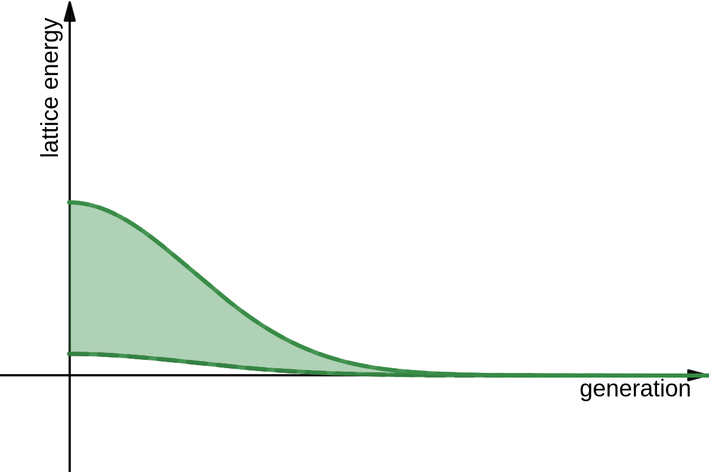

# Optimizing Lattice Energy in Site-Disordered $\text{Cu}_2\text{AgBiI}_6$

Ethan Meltzer, Oberlin College
*Dr. Sanjay Khare, Dr. Richard Irving, Victor Barone*
**UToledo REU in Physics 2023**

---

## Background

- Lead-free semiconductor synthesized at University of Liverpool in 2021 has promising applications in photovoltaics: simulated PCE of 30.2%, near-onset absorption coeff. of $1.0 \times 10^5\text{ cm}^{-1}$
- Initial research focused on synthesis and properties, simulations of internal structure using VASP performed serially, more computing power could result in more accurate structural models.
- Worth researching: better knowledge of internal structure nessecary to optimize solar cell design

<!-- footer: "*Harry C. Sansom et al.\nJournal of the American Chemical Society 2021 143 (10), 3983-3992 DOI: 10.1021/jacs.1c00495" -->

---

---

## Combinatoric Complexity

How can we efficiently find the global minimum of a discrete function with unpredictable behavior and a very large finite domain?

$${108 \choose 18}\text{Cu} * \left[{27 \choose 9} * {18 \choose 9}\right]\text{Ag/Bi} = 3.173 * 10^{31}\text{ configurations}$$

### Big number
- $\text{TB} = 10^{12}$ bytes, would need 4 quintillion 1 TB storage drives to represent each configuration with 1 bit
- In microns, roughly the diameter of the observable universe

<!-- footer: "" -->

---

## Genetic Algorithmic Approach

- Converges on minimum while only looking at a small sample of the possible configurations
- Individual simulations easily parallelizable, can run ~50 simultaneously on UToledo servers compared to one-at-a-time
- Evaluating efficacy in this field is an active research area, especially with irregular materials

---

# Thank you!

*emeltze@rockets.utoledo.edu*

---
## Acknowledgements and References

**Research Team:** Dr. Sanjay Khare\*, Dr. Richard Irving\*, Victor Barone\*
\
**Highly Absorbing Lead-Free Semiconductor Cu2AgBiI6 for Photovoltaic Applications from the Quaternary CuI–AgI–BiI3 Phase Space**
*Harry C. Sansom, Giulia Longo, Adam D. Wright, Leonardo R. V. Buizza, Suhas Mahesh, Bernard Wenger, Marco Zanella, Mojtaba Abdi-Jalebi, Michael J. Pitcher, Matthew S. Dyer, Troy D. Manning, Richard H. Friend, Laura M. Herz, Henry J. Snaith, John B. Claridge, and Matthew J. Rosseinsky*
Journal of the American Chemical Society 2021 143 (10), 3983-3992
DOI: 10.1021/jacs.1c00495 

<!-- footer: "* University of Toledo Department of Physics" -->

---

## First generation
- Some correlation between crystal symmetry/regularity and lattice energy in similar materials, many exceptions
- Skewing the first generation of configurations towards highly symmetric (high space group) configurations could lead to a faster convergence on a minimum.
- Accomplish this by binning the randomly generated first generation
  - Each bin is equal size but
  - Number of space groups represented in each bin varies

<!-- footer: "" -->

---

## Generating child configurations
- Configs for future generations are generated from the best of the previous generation
- Crossover: site filling is determined by indexing the occupied sites of the parents and selecting at random
- Mutation: A few occupied atomic sites in the child configuration will be swapped with ones chosen at random, most often resulting in an atom switching with a vacancy.

